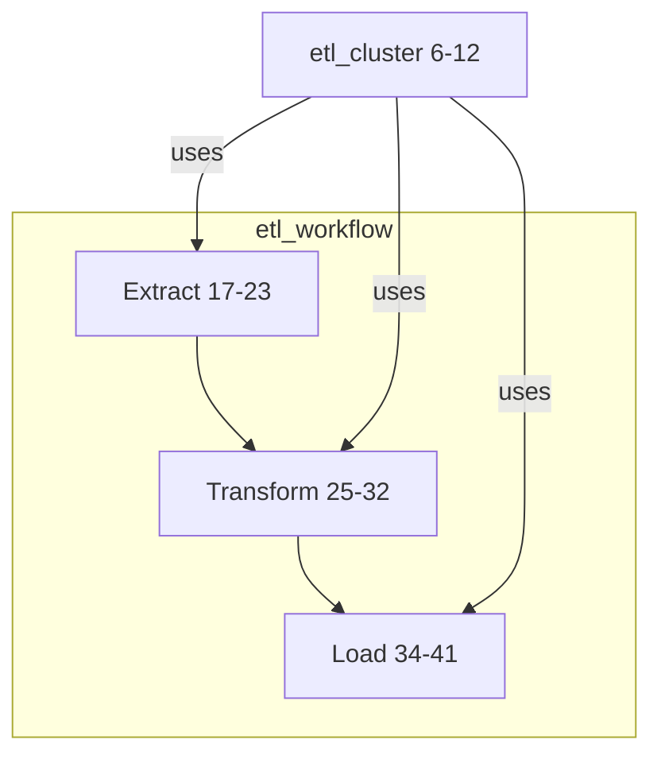

# terraform-parser
Automated Terraform workflow visualization for Databricks using Mermaid diagrams

## Quick Start
```bash
pip install -r requirements.txt
python parse_tf.py
```

## example mermaid
