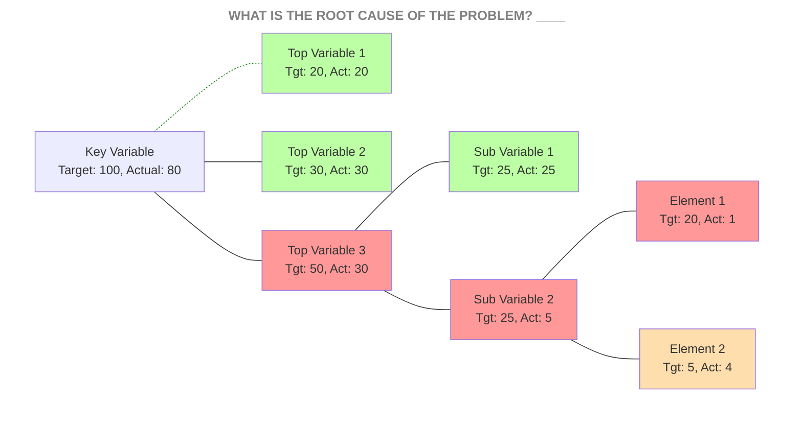

```mermaid
graph TD 
%% Adding a title to the flowchart using the SubGraph feature
subgraph SGTitle ["WHAT IS THE ROOT CAUSE OF THE PROBLEM? ____"]

%% Nodes
    0[Key Variable<br>Target: 100, Actual: 80]
    1[Top Variable 1<br>Tgt: 20, Act: 20]
    2[Top Variable 2<br>Tgt: 30, Act: 30]
    3[Top Variable 3<br>Tgt: 50, Act: 30]
    31[Sub Variable 1<br>Tgt: 25, Act: 25]
    32[Sub Variable 2<br>Tgt: 25, Act: 5]
    321[Element 1<br>Tgt: 20, Act: 1]
    322[Element 2<br>Tgt: 5, Act: 4]
    
%% Close title subgraph
end
    
%% Links
    0 -.- 1
    0 --- 2
    0 --- 3
    3 --- 31
    3 --- 32
    32 --- 321
    32 --- 322
    
%% Defining node styles
    classDef Red fill:#FF9999;
    classDef Amber	fill:#FFDEAD;
    classDef Green fill:#BDFFA4;

%% Assigning styles to nodes
    class 3,32,321 Red;
    class 322 Amber;
    class 1,2,31 Green;
    
%% Changing color of links [NOTE: Link arrows will remain black]
    linkStyle 0 fill: none, stroke: green;
    
%% Styling the title subgraph

    classDef Title fill:#FF99FF00, stroke-width:0, color:grey, font-weight:bold, font-size: 17px;
    class SGTitle Title;
```